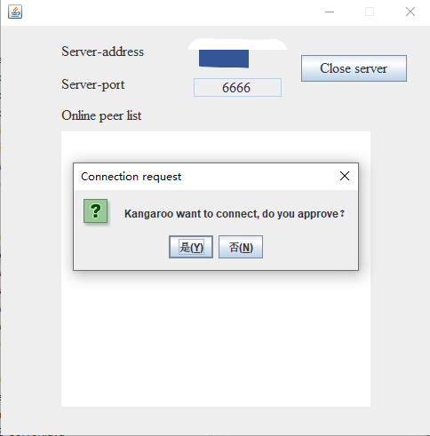
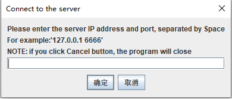

# Distributed-Shared-Whiteboard

## Features (功能简介)

This project achieves a **shared whiteboard** allows **multiple users to draw simultaneously on a canvas**. The major features are showing below:

该项目实现了**共享白板**，允许**多个用户在画布上同时绘制**。 主要功能如下所示：

1. Multiple users can draw on a **shared interactive canvas**.
   
   多个用户可以在**共享的交互式画布**上绘画。

2. **The single whiteboard is shared between all the clients**, that is, all the clients can see the same image of whiteboard and they are able to work on a drawing together in real time.
   
   **单个白板在所有客户端之间共享**，也就是说，所有客户端都可以看到相同的白板图像，并且他们能够实时一起绘制图形。

3. The program supports for **straight line, oval, rectangle, and text inputting**.The users can draw them **anywhere** inside the whiteboard.
   
   该程序支持**直线，椭圆，矩形和文本输入**。用户可以在白板内的**任何位置**绘制它们。

4. The first user to join will become an **_administrator_**. A notification is delivered to the administrator if any peer wants to join, then the administrator can decide whether **approves it or not**. If the administrator approves, then the user can continue to use, if not, then the client will be closed.
  
   第一个加入的用户会成为 **_管理员_** 。 如果任何新用户想要加入，则将加入申请发送给管理员，然后管理员可以决定 **是否同意该加入申请** 。 如果管理员批准，则用户可以继续使用，否则，该用户的客户端将被关闭。

5. An **_online peer list_** is maintained and displayed for every client.
   
   每个客户端维护并显示当前最新的 **_在线用户列表_**。

6. Online peers can choose to **leave** whenever they want. If the peer leaves, the **_online peer list_** of every client will be updated.
   
   在线用户可以选择随时**退出**。 如果在线用户退出，则将更新每个客户端的 **_在线用户列表_**。

7. When the administrator quits, the application will be **terminated**. All the peers will get a message notifying them.
   
   管理员退出后，该应用程序将被**终止**。 所有的在线用户都会收到一条消息，通知他们管理员已经退出。

8. The **advanced functions** include:
   - “New a whiteboard”
   - “Open a previously saved whiteboard”
   - “Save as the picture file (.png)”
   - “Save as the txt file (can be opened in the whiteboard)”
   - “Choose the user’s preferred directory to store the whiteboard” 
   - and “Close all whiteboards” (only the first client -- administrator can control it).

    **高级功能**包括:
    - 新建白板
    - 打开之前保存的白板
    - 将当前白板图像保存为 .png形式
    - 将当前白板图像保存为文本文件(可以用于在白板中读取并打开)
    - 用户可以选择喜欢的位置保存图片
    - 关闭所有白板 (只有第一个用户即管理员可以操作)

9.  The first user (administrator) is able to **kick out** a certain peer then the peer will get the notification and the **_online user list_** will be updated.

    第一个用户（管理员）能够**踢出**某个在线用户，然后该在线用户将收到通知并被踢出(该用户的客户端将被强制关闭)，并且将更新 **_在线用户列表_**。

## Screenshots (程序截图)

- Server
  
  - The first time open the server. (第一次启动服务器)
  
    

  - The new user wants to join the server (新用户想要加入该服务器).
  
    

- Client
  
  - Client interface (客户端界面)
    
    

## How to get started (如何运行)

### Programming environment (编程环境)

- System: Windows 10
- JDK version: Java - 13
- IDE: Eclipse IDE for Java Developers - 2020-06
- UI development tools: JAVA Swing

### How to import (如何导入)

This project is exported from Eclipse, so suggest using Eclipse to import it.

Please import [Distributed-Shared-Whiteboard-Client](Distributed-Shared-Whiteboard-Client) and [Distributed-Shared-Whiteboard-Server](Distributed-Shared-Whiteboard-Server) into Eclipse. The first one is client application and the second on is server application.

该程序由Eclipse导出，所以建议使用Eclipse导入，请导入[Distributed-Shared-Whiteboard-Client](Distributed-Shared-Whiteboard-Client) 和 [Distributed-Shared-Whiteboard-Server](Distributed-Shared-Whiteboard-Server)，其中第一个为客户端程序，第二个为服务器程序

### How to use (如何使用)

In [Runnable_JAR_Files](Runnable_JAR_Files), there are 2 runnable JAR files [Client.jar](Runnable_JAR_Files/Client.jar) and [Server.jar](Runnable_JAR_Files/Server.jar).

在[Runnable_JAR_Files](Runnable_JAR_Files)中有两个可执行JAR文件 [Client.jar](Runnable_JAR_Files/Client.jar) 和 [Server.jar](Runnable_JAR_Files/Server.jar)

First you should open [Server.jar](Runnable_JAR_Files/Server.jar) and if you can see **"Server is opened"** prompt then the server is running correctly.

首先你需要启动[Server.jar](Runnable_JAR_Files/Server.jar)，如果你可以看到 **"Server is opened"** 提示即证明你启动成功.

The **IP Address** and **Port** of Server are fixed. **IP Address** is ontained from your mahine. And **Port** is fixed: _6666_.

**IP Address** 和 **Port** 是确定了的，**IP Address**是你本机的IP地址，**Port**固定为 _6666_

Then, you should open [Client.jar](Runnable_JAR_Files/Client.jar) and input server **IP Address** and **Port number**, for example: "127.0.0.1 6666".

然后，你需要启动 [Client.jar](Runnable_JAR_Files/Client.jar) 并输入 **IP Address** 和 **Port number** ，例如："127.0.0.1 6666"。

After successful connection, you should see the picture above:

如果成功连接，你可以看到如下图片：

**Then just enjoy it!**

If you like this project, please **Star** it :)